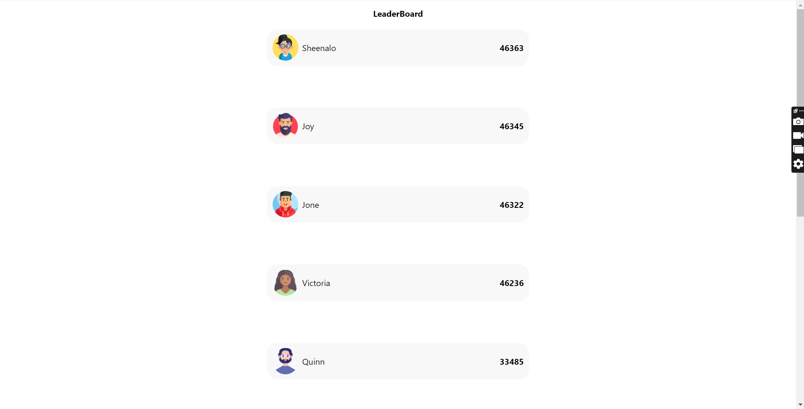

# LeaderBoard Animation

This project speaks about displaying profile pictures in a live-updating leaderboard using React, styled-components, and TypeScript. By ensuring each player's "picture" property points to a valid image URL or a default image, and updating the "Player" and "Leaderboard" components to handle these images, the leaderboard correctly shows profile pictures. This setup ensures smooth animations for score updates and position changes, meeting the project requirements.

# Demo Link

https://leader-board-six.vercel.app/

# Video Link

https://youtu.be/qh54AyIQXwY/

# Snippet

# Tech Stack

ReactJS, Typescript, Styled-components

# Instructions

To start, clone the repository by executing the command: "git clone [https://github.com/ay690/LeaderBoard.git]". After cloning, navigate into the repository directory and install dependencies using the command "npm install". Once the installation is complete, run the code with "npm run dev". Ensure to execute these commands in your terminal.
